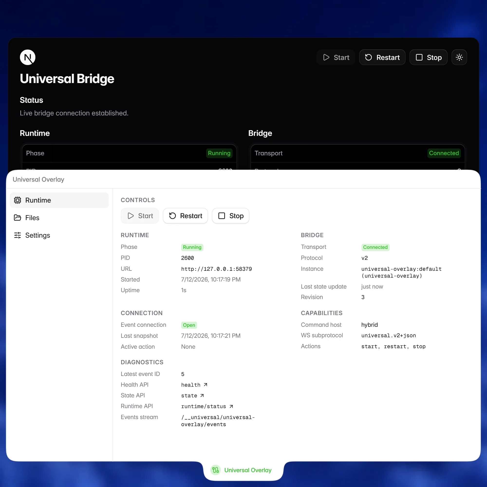

# Universal Overlay

Universal Overlay is a React reference overlay for the included framework hosts.
It mounts in a Shadow DOM, isolated from the host application.



## What the overlay demonstrates

Add `universalOverlay()` to a host's framework configuration. In development,
the adapter loads and mounts the overlay automatically—no browser import or
application component is needed.

```ts
import { universalOverlay } from "@example/universal-overlay";
import { defineConfig } from "vite";

export default defineConfig({
  plugins: [universalOverlay().vite()],
});
```

The overlay uses the namespaced bridge at `/__universal/universal-overlay/*`.

## What the reference overlay exercises

The Runtime view shows bridge state and controls. The Files view reads the host
project through the runtime API, illustrating how tools can proxy their own
runtime APIs through the bridge.

## Included framework hosts

| ID          | Framework  | Starting port |
| ----------- | ---------- | ------------- |
| `react`     | React      | 4601          |
| `vue`       | Vue        | 4602          |
| `sveltekit` | SvelteKit  | 4603          |
| `solid`     | Solid      | 4604          |
| `astro`     | Astro      | 4605          |
| `nextjs`    | Next.js    | 4606          |
| `nuxt`      | Nuxt       | 4607          |
| `vanilla`   | Vanilla JS | 4608          |
| `vinext`    | Vinext     | 4609          |

The runner assigns these ports, stops existing processes that use the selected
ports, and then starts the hosts.

## Prerequisites

- [Bun](https://bun.sh) (workspace package manager + script runner)
- Node.js 20 or 22 (required by some framework dev servers)

## Setup (first run)

```bash
bun run example:setup
```

This installs dependencies, builds `universal-bridge`, and builds the reference overlay.

Optional force re-link:

```bash
bun run example:setup --force
```

Use this after branch switches or lockfile changes if workspace links are stale.

## Run framework hosts

### Start all

```bash
bun run example
```

### Start selected hosts

```bash
bun run example react nextjs
bun run example vinext
```

### Disable browser auto-open

```bash
bun run example --no-open
bun run example react nextjs --no-open
```

The runner passes the assigned port to each host; example configs do not need
to set one.

## Verify bridge wiring

```bash
bun run verify:example
```

Verification checks each running example for:

- `GET /__universal/universal-overlay/health`
- `GET /__universal/universal-overlay/state`

You can target specific framework hosts:

```bash
bun run verify:example react nuxt
```

## Rebuild after changes

Rebuild when you change:

- `src/` (core package)
- `example/universal-overlay/src/` (overlay/runtime)

Commands:

```bash
bun run build
bun run --filter @example/universal-overlay build
```

## Example structure

Each `example/<framework>/` host applies the matching `universalOverlay()`
adapter and mounts the shared dashboard.

## Framework-specific notes

- **Vinext + Solid**: both use Vite adapter integration.
- **Vinext**: includes `resolve.dedupe` and `optimizeDeps.include` tweaks to avoid Bun workspace resolution issues.
- **Nuxt**: the host runner uses `--no-fork` for stability during multi-host runs.

## Troubleshooting

- If a framework host cannot resolve workspace packages, run `bun run example:setup --force`.
- If another host process is active, stop it before starting the runner.
- Stop running hosts with `Ctrl+C`.
